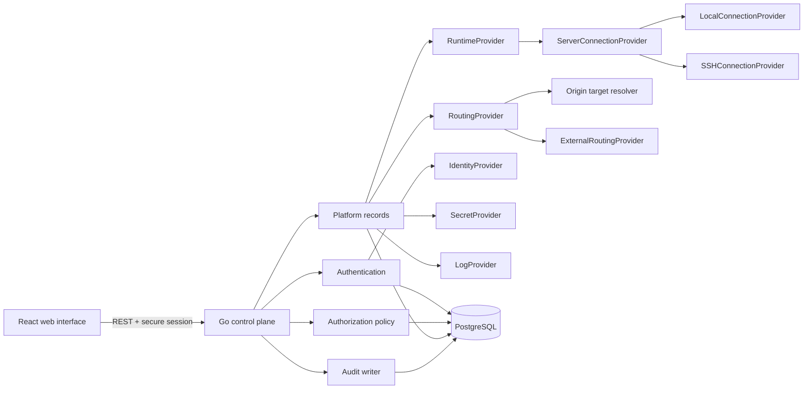
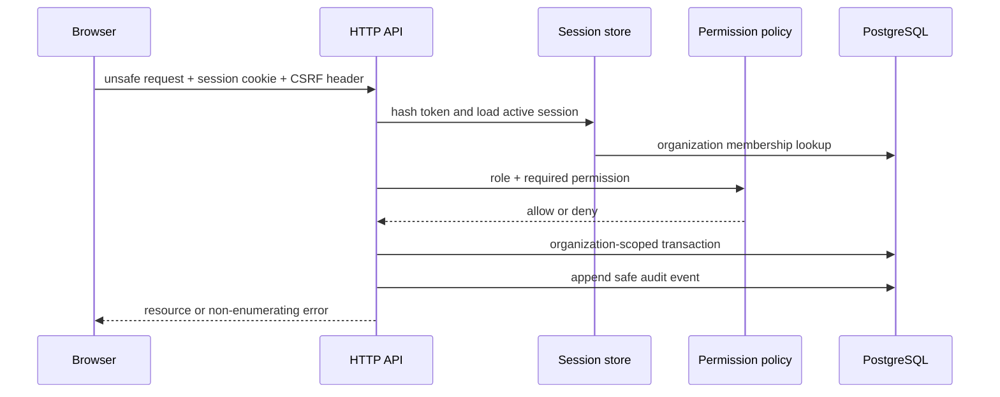

# Architecture

Silicon is a modular monolith. One Go process owns HTTP delivery and coordinates feature modules; PostgreSQL is the authoritative store. React consumes the versioned REST API. Independent processes are introduced only when deployment topology or privilege separation requires them.

## Module responsibilities

| Module | Responsibility and owned data | Public interface | Dependencies | Extension points | Security and tests |
|---|---|---|---|---|---|
| `auth` | Password hashing and opaque session tokens; users/sessions are persisted through the repository | `HashPassword`, `VerifyPassword`, token functions, auth endpoints | PostgreSQL repository, Argon2id | Identity-provider login can create a local session after explicit account linking | Constant-time verification; unit tests plus registration/login/logout integration flow |
| `authorization` | Role-to-permission policy | `Allowed`, `Permissions` | Membership role loaded from PostgreSQL | New permissions and policy evaluators | Deny by default; role matrix unit tests and API denial tests |
| `projects` / platform repository | Organizations, projects, environments, applications, servers and identity-provider records | Resource-oriented repository methods and REST handlers | PostgreSQL, authorization | Feature packages can replace repository grouping as behavior grows | Every query includes organization scope; cross-organization integration tests |
| `deployments` / `jobs` | State vocabulary, historical rows/events, ordered asynchronous execution | `ValidateTransition`, `DeploymentExecutor` | PostgreSQL, audit | Typed runtime executors | Invalid transitions fail; per-application ordering prevents stale queued revisions replacing newer ones |
| `execution` | Resolve source/configuration and coordinate ordered replacement | `DockerDeploymentExecutor` | Git, runtime and secret providers | Future source builders/transports | GitHub uses exact commits; fixed-port replacement is explicitly not zero downtime |
| `providers/runtime` | Typed deploy/lifecycle/inspection/status/log contract, target dispatcher and shared Docker adapter | `Provider`, `Dispatcher`, `DockerRuntimeProvider` | `ServerConnectionProvider` | Additional typed runtimes | Every destructive action verifies complete Silicon ownership labels |
| `providers/connection` | Local/SSH reachability, host identity, bounded command transport, protected file transfer and cloudflared installation | `Provider`, `CommandExecutor` | OS process execution or SSH | Future AWS/Azure connection providers | SSH keys are encrypted; host keys are pinned; no command endpoint exists |
| `serverconnections` | Organization-scoped connection selection and normalized origin resolution | `Check`, `Executor`, `ResolveOrigin` | Repository, encryption envelope, connection providers | Cloud-native connection/resolution adapters | Tenant scope is preserved before credentials are decrypted or targets resolved |
| `providers/git` | Source-provider boundary and GitHub App adapter | `Provider` | GitHub HTTPS API | Future GitLab adapter | Installation/repository identity and webhook signatures are verified |
| `providers/dns` | Provider-independent DNS desired state | `Provider` | Cloudflare adapter | Future DNS adapters | Ownership metadata prevents unrelated record overwrite/deletion |
| `providers/tunnel` | Optional multi-host tunnel routing | `Provider` | Cloudflare adapter | Future tunnel adapters | External/shared ownership is explicit and externally managed tunnels are read-only |
| `providers/routing` | Routing description boundary | `Provider`, `ExternalProvider` | None | Future X3 Gateway, Traefik or Nginx adapters | External provider truthfully leaves TLS/routing operator-managed |
| `providers/identity` | Federated identity boundary | `Provider` | Future mature OIDC library | Generic OIDC implementation and Authentik preset | Contract requires state/nonce and token validation; no crypto implementation here |
| `providers/secrets` | Secret write/resolve/delete boundary and local encrypted adapter | `Provider`, `LocalEncryptedSecretProvider` | AES-256-GCM envelope, PostgreSQL | Future Vault/cloud stores | Plaintext is write-only and never enters audit metadata or normal reads |
| `providers/logs` | Runtime-log query and streaming boundary | `Provider` | Runtime adapter | Local and external log backends | Workload output remains untrusted |
| `httpapi` | Routing, validation, sessions, CSRF, organization authorization, response shape and request logs | `/api/v1` | Feature policy/repository | SSE can be added to specific live resources | Size limits, unknown-field rejection, safe errors, request IDs; integration tested |
| `db` | Ordered transactional migrations | `Migrate` | PostgreSQL | Additive numbered SQL migrations | Empty-database integration test; constraints reinforce invariants |

## Dependency rule

Business decisions depend on interfaces and domain vocabulary. Concrete adapters depend inward on those contracts. Code must not branch throughout the domain on provider names. Provider selection belongs at the composition boundary.

## Request flow

## Data ownership

Organization is the tenant and security boundary. Projects, environments, applications, deployments, servers, domains, identity-provider records, secrets, and audit events carry an organization reference. Nested resources use composite foreign keys where useful, and repository queries scope by organization even when a globally unique ID is supplied.

See `docs/architecture/` and the ADRs for decision history.
