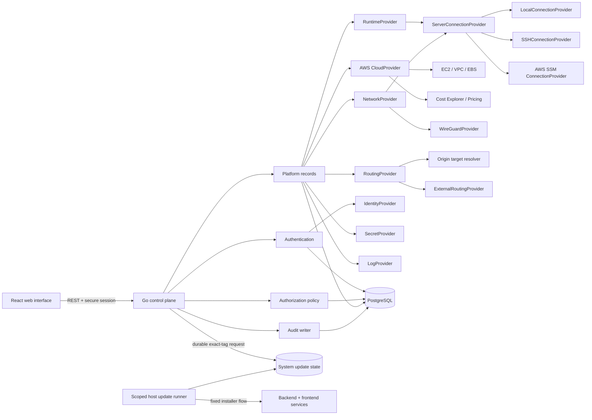
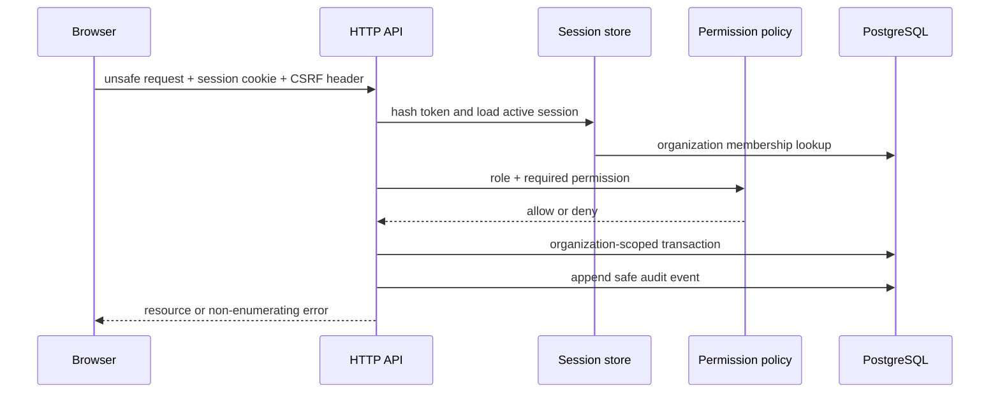

# Architecture

Silicon is a modular monolith. One Go process owns HTTP delivery and coordinates feature modules; PostgreSQL is the authoritative store. React consumes the versioned REST API. Independent processes are introduced only when deployment topology or privilege separation requires them.

```mermaid
flowchart LR
    Browser[React web interface] -->|REST + secure session| API[Go control plane]
    API --> Auth[Authentication]
    API --> Policy[Authorization policy]
    API --> Platform[Platform records]
    Platform --> Runtime[RuntimeProvider]
    Runtime --> Connection[ServerConnectionProvider]
    Connection --> Local[LocalConnectionProvider]
    Connection --> SSH[SSHConnectionProvider]
    Connection --> SSM[AWS SSM ConnectionProvider]
    Platform --> Cloud[AWS CloudProvider]
    Cloud --> EC2[EC2 / VPC / EBS]
    Cloud --> Billing[Cost Explorer / Pricing]
    Platform --> Routing[RoutingProvider]
    Platform --> PrivateNetwork[NetworkProvider]
    PrivateNetwork --> WireGuard[WireGuardProvider]
    PrivateNetwork --> Connection
    Routing --> Origin[Origin target resolver]
    Auth --> Identity[IdentityProvider]
    Platform --> Secret[SecretProvider]
    Platform --> Logs[LogProvider]
    Auth --> DB[(PostgreSQL)]
    Policy --> DB
    Platform --> DB
    API --> Audit[Audit writer]
    Audit --> DB
    Routing --> External[ExternalRoutingProvider]
    API -->|durable exact-tag request| UpdateDB[(System update state)]
    Updater[Scoped host update runner] --> UpdateDB
    Updater -->|fixed installer flow| Services[Backend + frontend services]
```

## Module responsibilities

| Module | Responsibility and owned data | Public interface | Dependencies | Extension points | Security and tests |
|---|---|---|---|---|---|
| `auth` | Password hashing and opaque session tokens; users/sessions are persisted through the repository | `HashPassword`, `VerifyPassword`, token functions, auth endpoints | PostgreSQL repository, Argon2id | Identity-provider login can create a local session after explicit account linking | Constant-time verification; unit tests plus registration/login/logout integration flow |
| `authorization` | Role-to-permission policy | `Allowed`, `Permissions` | Membership role loaded from PostgreSQL | New permissions and policy evaluators | Deny by default; role matrix unit tests and API denial tests |
| `projects` / platform repository | Organizations, projects, environments, applications, servers and identity-provider records | Resource-oriented repository methods and REST handlers | PostgreSQL, authorization | Feature packages can replace repository grouping as behavior grows | Every query includes organization scope; cross-organization integration tests |
| `deployments` / `jobs` | State vocabulary, historical rows/events, ordered asynchronous execution | `ValidateTransition`, `DeploymentExecutor` | PostgreSQL, audit | Typed runtime executors | Invalid transitions fail; per-application ordering prevents stale queued revisions replacing newer ones |
| `configuration` / `execution` | Parse configuration, resolve project -> environment -> application precedence, and coordinate ordered replacement | `.env` parser, effective configuration resolver, `DockerDeploymentExecutor` | Git, runtime and secret providers | Future configuration providers/source builders | GitHub uses exact commits; secrets remain write-only; fixed-port replacement is explicitly not zero downtime |
| `providers/runtime` | Typed deploy/lifecycle/inspection/status/log contract, target dispatcher and shared Docker adapter | `Provider`, `Dispatcher`, `DockerRuntimeProvider` | `ServerConnectionProvider` | Additional typed runtimes | Every destructive action verifies complete Silicon ownership labels |
| `providers/connection` | Local/SSH/SSM reachability, host identity, bounded command transport, protected file transfer and cloudflared installation | `Provider`, `CommandExecutor` | OS process execution, SSH, or AWS SSM | Future Azure connection providers | SSH keys are encrypted; host keys are pinned; SSM commands remain typed; no command endpoint exists |
| `providers/cloud/aws` | Normalized AWS identity, regional compute/network/storage inventory, guarded lifecycle, dynamic AMI resolution, actual cost and estimates | `Factory`, `Provider`, `SSMRunner` | Official AWS SDK for Go v2 | Additional cloud capabilities without SDK types leaking into core | Temporary credentials, ownership classification/tags, safe provider errors and mocked tests |
| `awsaccounts` | Organization-scoped AWS credential resolution and decryption | `OpenAWS` | Repository, encryption envelope, AWS factory | Alternative credential brokers | Credentials are opened only after tenant scope is proven and cleared after client construction |
| `budgets` | Deterministic threshold crossing and scoped cost policy | `ThresholdsCrossed` | PostgreSQL budget records, per-account monthly cost snapshots, AWS allocation tags | AWS-backed budgets later | Cross-account totals require complete snapshots; unavailable project/environment attribution remains unevaluated; no destructive enforcement |
| `serverconnections` | Organization-scoped connection selection and normalized origin resolution | `Check`, `Executor`, `ResolveOrigin` | Repository, encryption envelope, connection providers | Cloud-native connection/resolution adapters | Tenant scope is preserved before credentials are decrypted or targets resolved |
| `providers/git` | Source-provider boundary and GitHub App adapter | `Provider` | GitHub HTTPS API | Future GitLab adapter | Installation/repository identity and webhook signatures are verified |
| `providers/dns` | Provider-independent DNS desired state | `Provider` | Cloudflare adapter | Future DNS adapters | Ownership metadata prevents unrelated record overwrite/deletion |
| `providers/tunnel` | Optional multi-host tunnel routing | `Provider` | Cloudflare adapter | Future tunnel adapters | External/shared ownership is explicit and externally managed tunnels are read-only |
| `providers/routing` | Routing description boundary | `Provider`, `ExternalProvider` | None | Future X3 Gateway, Traefik or Nginx adapters | External provider truthfully leaves TLS/routing operator-managed |
| `providers/network` | Organization-private overlays, host identity, internal DNS and east-west policy desired state | `Provider`, `NodeConfiguration` | Typed server connections, WireGuard, CoreDNS, nftables | Additional private-network providers | Private keys stay host-side; cross-org links are impossible; only Silicon-owned firewall tables are changed |
| `providers/identity` | Federated identity boundary | `Provider` | Future mature OIDC library | Generic OIDC implementation and Authentik preset | Contract requires state/nonce and token validation; no crypto implementation here |
| `providers/secrets` | Project/environment/application secret write, resolve, and delete boundary | `Provider`, `LocalEncryptedSecretProvider` | AES-256-GCM envelope, PostgreSQL | Future Vault/cloud stores | Application > environment > project precedence; plaintext is write-only and never enters audit metadata or normal reads |
| `providers/logs` | Runtime-log query and streaming boundary | `Provider` | Runtime adapter | Local and external log backends | Workload output remains untrusted |
| `httpapi` | Routing, validation, sessions, CSRF, organization authorization, response shape and request logs | `/api/v1` | Feature policy/repository | SSE can be added to specific live resources | Size limits, unknown-field rejection, safe errors, request IDs; integration tested |
| `updates` / `silicon-updater` | Stable GitHub Release discovery, durable update state, exact-tag verification and fixed installer execution | `/api/v1/system/updates`, database queue | GitHub Releases, PostgreSQL, production installer | Alternate signed release sources can implement the narrow source interface | Installation-admin authorization; no generic command API; configuration hash and persistent-state preflight |
| `db` | Ordered transactional migrations | `Migrate` | PostgreSQL | Additive numbered SQL migrations | Empty-database integration test; constraints reinforce invariants |

## Dependency rule

Business decisions depend on interfaces and domain vocabulary. Concrete adapters depend inward on those contracts. Code must not branch throughout the domain on provider names. Provider selection belongs at the composition boundary.

Private network changes create organization-scoped reconciliation jobs. The runner resolves members through `ServerConnectionProvider`, asks the selected `NetworkProvider` to ensure host identity and apply validated desired state, and persists per-member and operation status. The first provider uses a public hub plus NAT-capable spokes. CoreDNS runs on the hub, while application deployments bind private service ports to member overlay addresses and receive the `.internal` resolver. Cloudflare routing remains a separate north-south ingress path.

## Request flow

```mermaid
sequenceDiagram
    participant UI as Browser
    participant API as HTTP API
    participant Session as Session store
    participant Policy as Permission policy
    participant DB as PostgreSQL
    UI->>API: unsafe request + session cookie + CSRF header
    API->>Session: hash token and load active session
    Session->>DB: organization membership lookup
    API->>Policy: role + required permission
    Policy-->>API: allow or deny
    API->>DB: organization-scoped transaction
    API->>DB: append safe audit event
    API-->>UI: resource or non-enumerating error
```

## Data ownership

Organization is the tenant and security boundary. Projects, environments, applications, deployments, servers, domains, AWS accounts/resource ownership/budgets, identity-provider records, secrets, and audit events carry an organization reference. Nested resources use composite foreign keys where useful, and repository queries scope by organization even when a globally unique ID is supplied.

See `docs/architecture/` and the ADRs for decision history.
