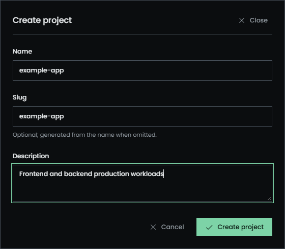
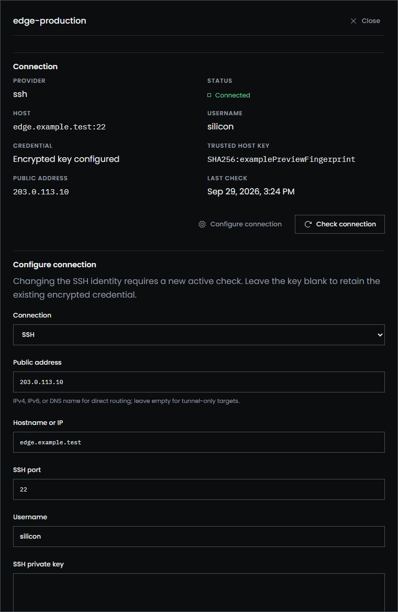
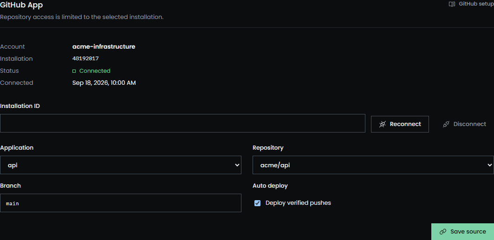
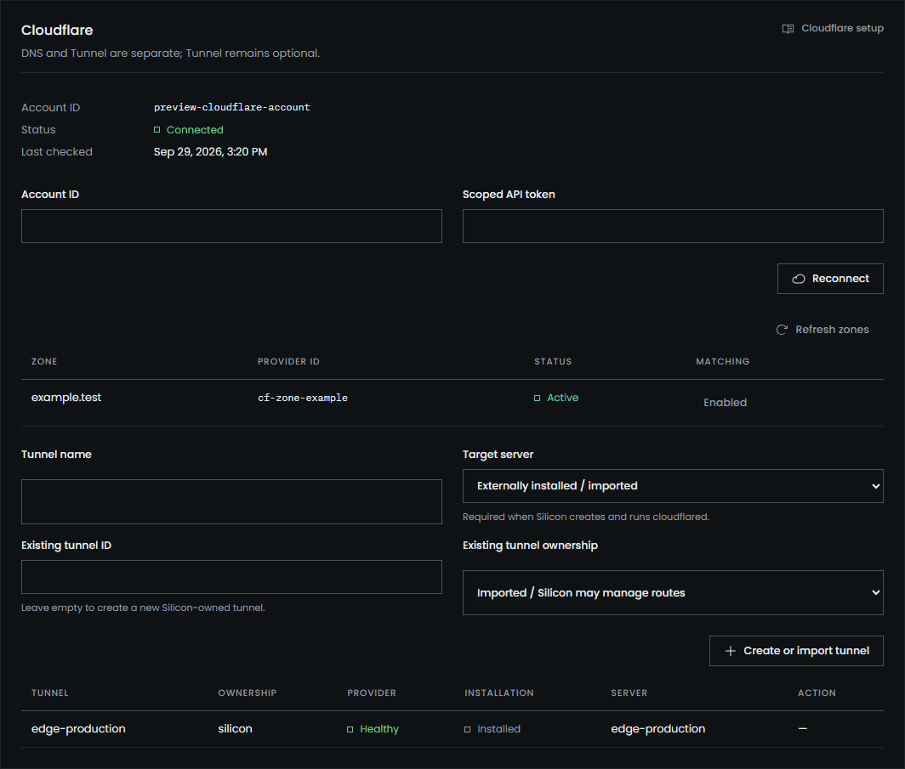
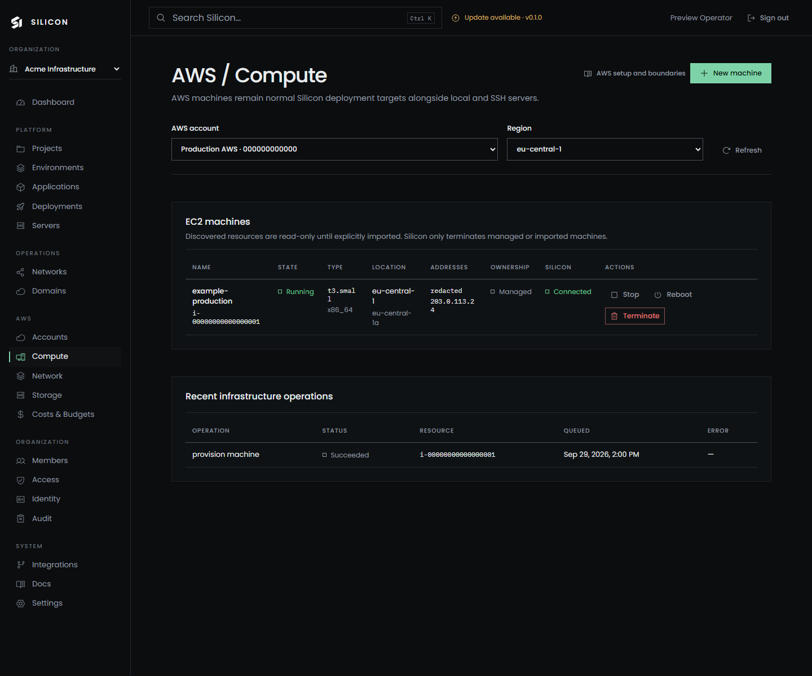
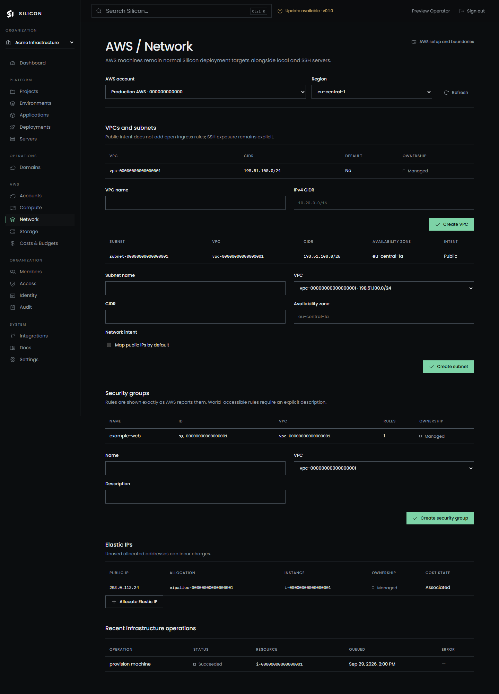

# Silicon user guide

These Markdown articles are the source for Silicon's in-panel documentation and remain readable directly on GitHub.

The in-panel guide is installation-focused: it explains how to operate the Silicon instance currently open in the browser. The independent [Silicon public documentation](https://itsmangooo.github.io/Silicon-Docs/) contains the broader operator, architecture, source-code, security, and contribution manual. The public site is a standalone static Docusaurus build and is not loaded from the panel or backend.

## Getting started

- [Getting started](getting-started.md)
- [Core concepts](core-concepts.md)

## Workloads

- [Complete frontend + backend example](frontend-backend-example.md)
- [Self-hosted project](self-hosted-project.md)
- [Applications and configuration](applications.md)
- [Deployments](deployments.md)

## Infrastructure and integrations

- [Servers and SSH](servers.md)
- [Private networking](private-networking.md)
- [GitHub setup and auto-deploy](github.md)
- [Cloudflare DNS and Tunnel](cloudflare.md)
- [AWS project](aws.md)

## Security and operations

- [Security model](security.md)
- [Administration](administration.md)
- [Troubleshooting](troubleshooting.md)

The panel route for each article is stable and includes generated heading anchors. Search documentation from the Docs sidebar, or use the global `Ctrl+K` / `Command+K` palette to search pages, resources, commands, and these articles together.

## Current previews

| In-panel documentation | Global search |
| --- | --- |
|  |  |

| Safe tagged updates |
| --- |
|  |

| Application creation |
| --- |
|  |

| Project and environment | SSH server setup |
| --- | --- |
|  |  |

| GitHub source | Cloudflare routing |
| --- | --- |
|  |  |

| AWS compute | AWS network |
| --- | --- |
|  |  |

The screenshots use isolated `example.test` preview fixtures. The production application does not seed those identities or resources. Regenerate the complete set after frontend changes with `cd frontend && npm run preview:capture`.
